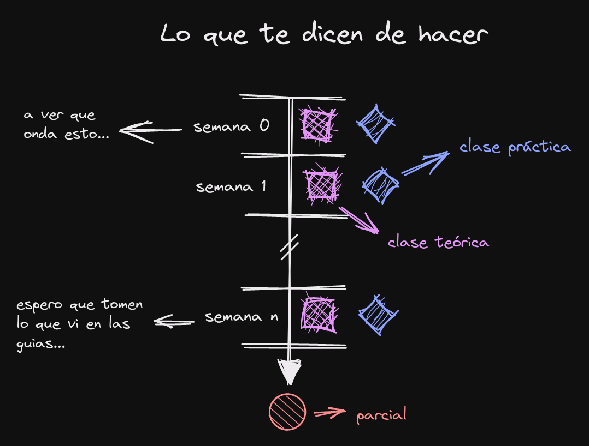
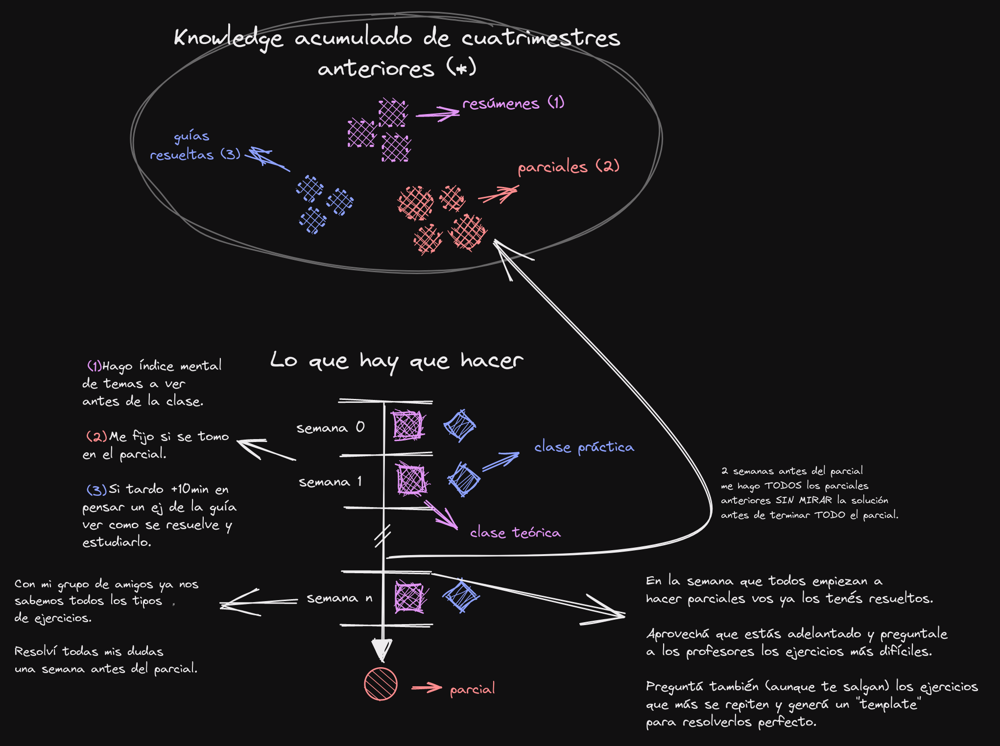

El ITBA no es fácil. La mayoría de nosotros vamos a pasar más de cinco años acá y cada experiencia es diferente

Ahora tengo hecho más del 50% de Ing. Informática y me estoy adelantando al plan de la carrera, con un promedio por encima de la media.

Mientras iba cursando me fui dando cuenta algunos hábitos que seguían los alumnos con mejores notas y aplicarlos me sirvió para estudiar menos y tener mejor rendimiento.

Esto es lo que yo necesitaba cuando estaba empezando la facultad y hoy se los quiero dejar como un manual para “hackear” al ITBA.

## Recomendaciones generales

**Seguí el plan de la carrera, por algo esta así.**

Antes de que empiece el cuatrimestre, investigá cuáles son las materias más difíciles y ordená por nivel de dificultad. Dedicale más tiempo a estudiar las más difíciles: es importante que las guías estén al día.

Priorizá tener todo “aprobado” que muy buenas notas en algunas materias y re-cursar una: a largo plazo no hay diferencia entre un 6 y un 10.

**Las materias que estás cursando ya las cursó alguien antes. Buscá esas personas, preguntáles que temas conviene estudiar y cuáles no sirven.**

Buscá a alguien que esté un cuatrimestre adelantado (él tiene las cosas más recientes: pedile los TPs y parciales), otro que esté varios años delante (te va a dar recomendaciones sobre electivas, intercambios y profesores) y otro que ya se haya recibido (te va a servir para tener una visión más amplia de que cosas realmente sirven fuera de la facultad).

**Buscá las guías resueltas.**

Muchos profesores dicen que no las veas, pero la mayoría de la gente con buen promedio las ve. Te sirve para tener el “big picture” y entender cuales cosas sirven para el parcial.

Entendé que la idea idea es hacer las guías rápido para estar al día y poder resolver ejercicios de parciales.

**Hay veces que uno cree estar al día pero la realidad es otra.**

Conseguí un grupo de +5 amigos que sean más capaces que vos, estudiá con ellos.

Preguntales semanalmente cómo van con las guías y cerca de los exámenes (en general dos semanas antes) hagan parciales juntos.

SIEMPRE es una mala idea estudiar solo.

**Intenta tener apuntes compartidos con tus amigos.**

Tener un único apunte te va a asegurar dos cosas:

1) Vas a tener la misma base de estudio que tus otros amigos.

2) Vas a tener un apunte más completo porque lo hicieron varias personas.

Estos apuntes siempre complementalos con apuntes de cuatrimestres pasados.

Acordate la regla de oro: SIEMPRE hay uno que ya aprobó la materia que estás cursando, fijate cómo hizo.

**Si vivís lejos de la facultad repasá mientras estás en el transporte público.**

La idea es re-leer por arriba lo que aprendiste en el día. Hacerlo te va a permitir ver el big-picture de lo que dieron.

**Antes de empezar el cuatrimestre buscá los calendarios de las materias y fijate en que días se dan los temas.**

Yo los sincronizo con Google Calendar y antes de tener la clase leo los apuntes de cuatrimestres anteriores.

No importa leer al detalle, yo leo los títulos principales de lo que voy a ver. Después en la clase vas a entender mejor por qué parte de los conceptos del día vas y ya vas a estar preparado para lo que den.

Esta técnica sirve mucho si en general te aburrís en las clases: uno nunca sabe cuanto falta para terminar. Con esta nueva forma tenes un “índice mental” que vas tachando a medida que dan los temas.

## Como preparar una materia

Acá les dejo dos diagramas para que vean cómo estudio para la facultad.

<figure>
  
  <figcaption>Lo que todo el mundo hace.</figcaption>
</figure>

<figure>
  
  <figcaption>Lo que yo hago para estudiar menos y que me vaya mejor.</figcaption>
</figure>

## Lista de recursos si cursas en ITBA

[Reddit](https://www.reddit.com/r/me_ITBA/)

Instagram

- [Página Oficial](https://www.instagram.com/itbauniversidad/)
- [itbamemes](https://www.instagram.com/itbamemes/)
- [ceitba](https://www.instagram.com/ceitba/)
- [itbajoneros](https://www.instagram.com/itbajoneros/)
- [itba_gaming](https://www.instagram.com/itba_gaming/)
- [asme.itba](https://www.instagram.com/asme.itba/)
- [embs.itba](https://www.instagram.com/embs.itba/)
- [brainware.itba](https://www.instagram.com/brainware.itba/)
- [itbafutbol](https://www.instagram.com/itbafutbol/)
- [wie_itba](https://www.instagram.com/wie_itba/)
- [buddiesitba](https://www.instagram.com/buddiesitba/)
- [itbaglobal](https://www.instagram.com/itbaglobal/)
- [itbabasquet](https://www.instagram.com/itbabasquet/)
- [itba.love](https://www.instagram.com/itba.love/)
- [aiche_itba](https://www.instagram.com/aiche_itba/)
- [computer.society.itba](https://www.instagram.com/computer.society.itba/)
- [itbadank](https://www.instagram.com/itbadank/)
- [ieee.itba](https://www.instagram.com/ieee.itba/)
- [trama.itba](https://www.instagram.com/trama.itba/)
- [speitbasc](https://www.instagram.com/speitbasc/)
- [mecanicaitba](https://www.instagram.com/mecanicaitba/)
- [memesitba](https://www.instagram.com/memesitba/)
- [graduadositba](https://www.instagram.com/graduadositba/)
- [turing.itba](https://www.instagram.com/turing.itba/)
- [itba_competicion](https://www.instagram.com/itba_competicion/)
- [ajedrezitba](https://www.instagram.com/ajedrezitba/)
- [conexion.itba](https://www.instagram.com/conexion.itba/)
- [techtrekar](https://www.instagram.com/techtrekar/)

Discord

- [Crypto Community ITBA](https://discord.gg/EZsuanY7)
- [ITBA Gaming](https://discord.gg/4FtcdVmP)
- [Instituto Tecnológico de Buenos Aires](https://discord.gg/sCPUQXsW)

Google Drive

- [ITBA Informática](https://drive.google.com/drive/folders/0B-jdQcSzLnNVfjNWU0lEbXc4TUE2ZFFYRXlSV2RoOC1CcnAzWUM1QU9TQTRjYVh6Y1NIaEk?resourcekey=0-sDLiRLuBVz1uWn1Z8RYXTw&usp=sharing)
- [Apuntes Tincho](https://drive.google.com/drive/folders/14Q34ulTsCxBPNgSG1dv4Q-Isqb3tSI2U?usp=sharing)
- [Apuntes Britu](https://drive.google.com/drive/folders/137AUpxGFOfqPYj2U1dZm4zJosRejQAug?usp=sharing)

La verdad son un monton más.

Una idea para mantener esta lista de recursos es tener esto actualizado es un github pages opensource con todos los links. 

Si hay un par de informáticos manijas que les gusta la idea los puedo mentorear/ayudar 
con las tecnologías para hacerlo.