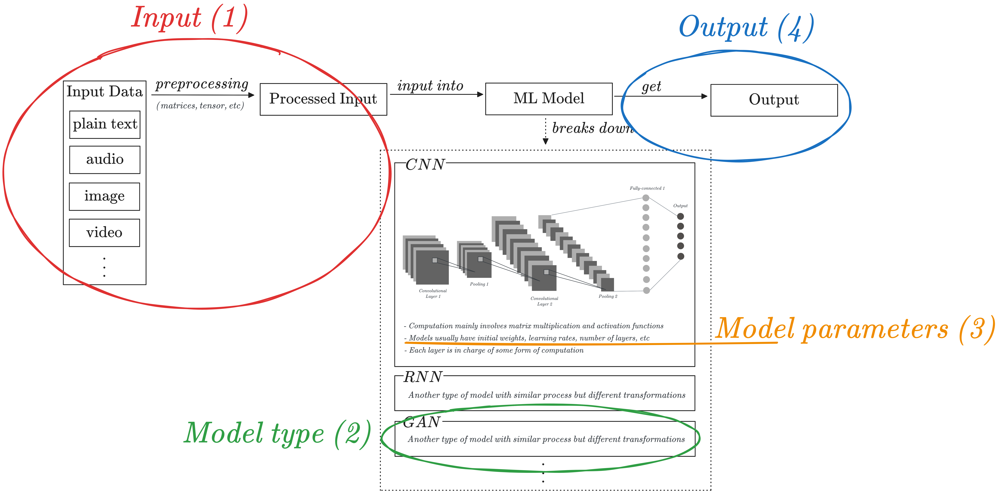
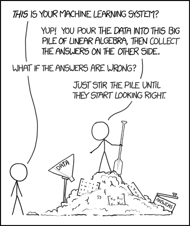
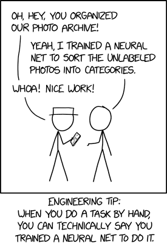
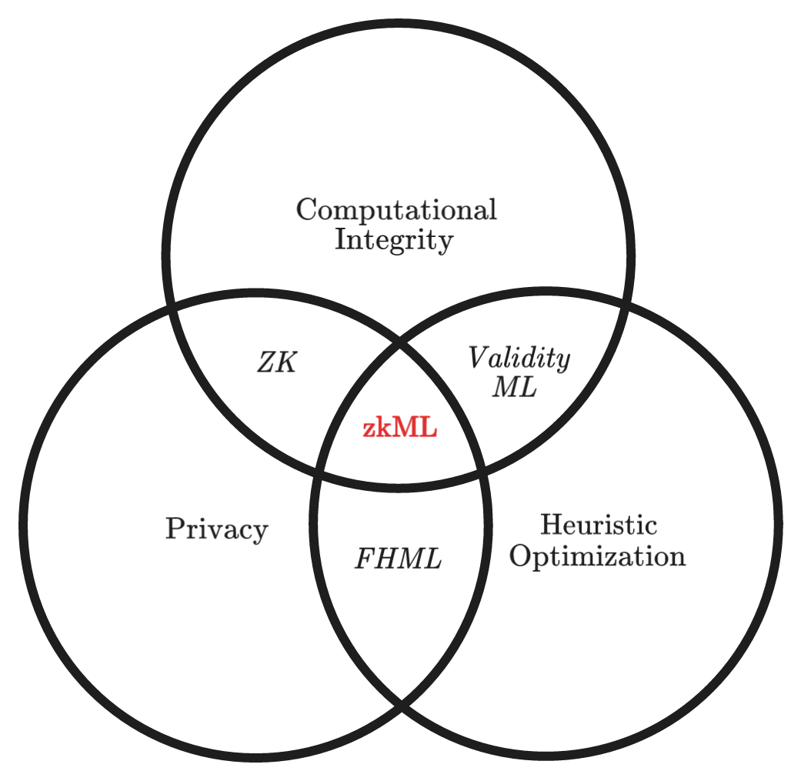

This post serves as a soft introduction to the fascinating realm of zero knowledge machine learning (zkML) and its underlying concepts.

## An ELI5 introduction to ML models

Machine learning (ML) models can seem overwhelming, but they can be broken down into four main parts: input, model type, model parameters, and output.

The input data is preprocessed into a format suitable for the model, and initial parameters are set up (depending on the model used), including layers, weights, biases, and learning rates. The model then learns to extract relevant features between them, with the output serving as input for the next layer.

## Issues with the state of the art of ML

### The black-box trust issue with ML

As Artificial Intelligence (AI) and ML become more integrated into our daily lives, issues of trust are becoming increasingly critical. ML models’ lack of transparency and black-box algorithms are two main reasons behind trust issues, making it difficult to trust ML inferences.

### The privacy issue with ML

With lightweight ML frameworks and interoperable formats, such as ONNX, we can now perform ML inference on edge devices such as mobile phones or IOT devices without sending the (potentially sensitive) input to centralized servers.  However, several privacy-related challenges persist:

- There is often a desire to hide the input and/or the model parameters from the public view.
    - The input data provided to ML models may include personal and confidential information, such as financial data, biometric records, or private multimedia.
    - The model parameters themselves may contain sensitive details, such as biometric authentication parameters.
- Simultaneously, downstream entities that rely on the outputs of ML models, such as on-chain smart contracts, must ensure the veracity of the input's processing by the ML model, validating the correctness of the claimed output.

## Welcome to the zkML rabbit hole

**Heuristic optimization**
Heuristic optimization is an approach to problem-solving that leverages rules of thumb, commonly referred to as "heuristics," to find effective solutions for complex problems that are challenging to solve using conventional optimization methods. Instead of aiming for the globally optimal solution, heuristic optimization methods strive to identify a satisfactory or "good enough" solution within a reasonable time frame. The selection of an appropriate solution is influenced by the problem's significance within the overall system and the inherent difficulty involved in its optimization.

**Fully Homomorphic Encryption ML (FHE-ML)**
Fully Homomorphic Encryption (FHE) in the context of machine learning (ML) empowers developers to perform operations on encrypted data. When decrypted, the output of these operations corresponds to the result of applying the operations on the original, unencrypted input. FHE-ML provides a means to evaluate ML models in a privacy-preserving manner, ensuring full data privacy. It should be noted, however, that unlike Zero Knowledge Proofs (ZK proofs), FHE-ML does not offer a cryptographic means to verify the correctness of the computations being performed.

**ZK proofs vs. Validity proofs**
In the industry, the terms "ZK proofs" and "validity proofs" are sometimes used interchangeably, as validity proofs represent a specific subset of ZK proofs where no parts of the computation or its results are concealed. Within the context of zkML, current applications predominantly leverage the validity proof aspect of ZK proofs.

**Validity ML**
Validity ML, exemplified by the employment of SNARKs (Succinct Non-interactive Arguments of Knowledge) and STARKs (Scalable Transparent Arguments of Knowledge), refers to the practice of constructing proofs for ML models where all computations are publicly observable by the verifier. Any verifier can subsequently authenticate the computational correctness of the ML models, ensuring transparency and trustworthiness.

**zkML** 
In contrast to validity ML, zkML employs ZK proofs to establish the computational correctness of ML models while concealing the underlying computations from the verifier, utilizing the zero-knowledge property. By leveraging ZK proofs, the prover can furnish evidence for the accuracy of the ML models without divulging any further information, thus providing a powerful tool for preserving privacy and confidentiality.

### Uses cases of zkML

**Transparency in MLaaS**

In MLaaS, validating the authenticity and integrity of models provided by different service providers poses a challenge due to the black-box nature of APIs. To address this, incorporating validity proofs becomes crucial. Providing validity proofs attached to an ML model API would be useful to provide transparency to the user as they can verify which model they are using.

**Privacy-Preserving Medical Diagnostics**

Medical diagnostics on private patient data get fed into the model and the sensitive inference (e.g., cancer test result) gets sent to the patient.

**Confidential Financial Data Analysis**

zkML offers a viable solution by allowing financial institutions to collaborate on analyzing data without sharing the raw information. This enables multiple parties to collectively train ML models while maintaining data privacy, thereby enhancing fraud detection capabilities and risk management practices.

**Secure Federated Learning**

Federated Learning, a collaborative approach that trains ML models across multiple decentralized devices or institutions, necessitates robust privacy protection. ZKML can play a pivotal role in this context by ensuring that sensitive data never leaves the local devices.

## References

1. [Awesome ZKML GitHub Repository](https://github.com/worldcoin/awesome-zkml)
2. [ezDPS: An Efficient and Zero-Knowledge Machine Learning Inference Pipeline](https://arxiv.org/pdf/2212.05428.pdf)
3. [Zero Knowledge Proofs for Decision Tree Predictions and Accuracy](https://dl.acm.org/doi/pdf/10.1145/3372297.3417278)
4. [ZK-MNIST Blog Post](https://0xparc.org/blog/zk-mnist)
5. [ONNX.ai Official Website](https://onnx.ai/)
